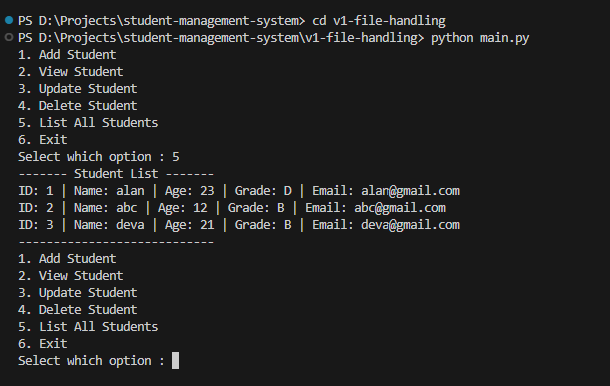
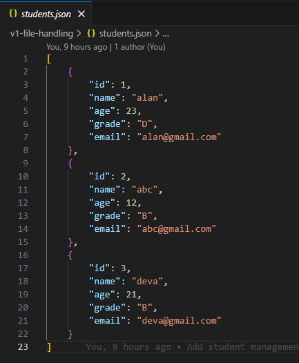
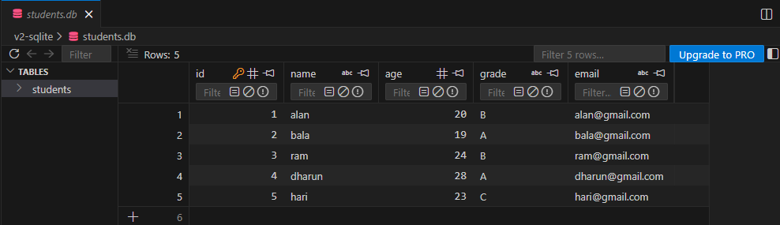

# Student Management System

A command-line based Student Management System built using Python.  
This project demonstrates two different data storage approaches:

- Version 1: File handling using JSON
- Version 2: SQLite database integration

The system allows managing student records with structured operations and modular code design.

---

## Project Overview

This repository contains two implementations of the same system:

- **v1-file-handling** → Stores student data in a JSON file.
- **v2-sqlite** → Stores student data in a SQLite database.

The second version improves data persistence and scalability by replacing file storage with a relational database.

---

## Features

- Add new students
- View student records
- Update existing student details
- Delete student records
- Modular structure (separate manager and data handling logic)
- Two storage implementations (JSON & SQLite)

---

## Technologies Used

- Python 3
- JSON (File handling)
- SQLite3 (Database)

---

## How to Run

### Version 1 – File Handling (JSON)

1. Navigate to the v1-file-handling folder:
   ```bash
   cd v1-file-handling

2. Run the program:
   python main.py


Student data will be stored in `students.json`.

---

### Version 2 – SQLite Database

1. Navigate to the v2-sqlite folder:
   ```bash
   cd v2-sqlite

2. Run the program:
   python main.py


The database file will be created automatically if it does not exist.

---

## Sample Output


### Main Menu & Student List Output



---

### Version 1 – File Handling(JSON file output)



---

### Version 2 – SQLite (DB output)



---

## Notes

- The project follows a modular structure separating business logic and data handling.
- Version 2 improves data handling by using a structured relational database.
- SQLite version improves data integrity and scalability compared to file handling.
